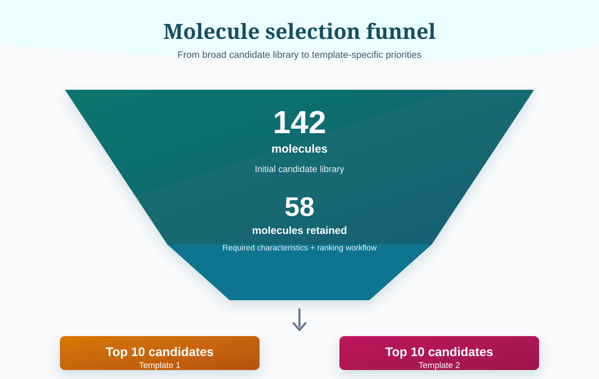

# SOD1 Docking: Pareto Optimisation and Molecule Ranking

This project contains a computational workflow for prioritising small-molecule candidates designed to bind the Trp32/Loop II region of mutant superoxide dismutase 1 (SOD1). The workflow combines docking and pose-quality measures with physicochemical, ADMET and stereochemical properties to identify candidates for further investigation as protein-of-interest (POI) ligands in a potential SOD1-targeted PROTAC strategy.

## Background

Motor neurone disease (MND), including amyotrophic lateral sclerosis (ALS), is a progressive neurodegenerative disease involving the loss of motor neurons. SOD1 is one of the best-characterised genes associated with familial ALS. Disease-associated SOD1 variants can destabilise the native protein, promote misfolding and aggregation, and produce a toxic gain of function.

This project focuses on mutant SOD1 as a structurally defined and ligandable target. The Trp32/Loop II region provides a non-covalent binding site that can be explored through fragment-based design and molecular docking. A ligand for this site could provide the POI-binding component of a PROTAC: a bifunctional molecule that links a target-protein ligand to an E3 ubiquitin-ligase recruiter through a chemical linker. The resulting ternary complex can promote ubiquitination and subsequent proteasomal degradation of the target protein.

The non-covalent nature of the Trp32/Loop II ligand is important for this strategy. Reversible binding allows the PROTAC to participate in repeated cycles of ternary-complex formation, ubiquitination and dissociation, rather than remaining permanently attached to the target.

## Project Aim

The aim is to rank a library of `MOL-*` candidates and identify molecules that provide a balanced combination of:

- favourable docking performance;
- reproducible binding poses across SOD1 crystal structures;
- ligand efficiency;
- acceptable physicochemical and ADMET characteristics; and
- fully defined stereochemistry where relevant.

The workflow is multi-objective. It therefore preserves genuine trade-offs between candidates instead of reducing every property to a single docking score at the beginning of the analysis.

## Data and Outputs

The notebook analyses docking, pose, physicochemical and ADMET results supplied in the project workbook. The input workbook and generated data files are not included in this repository.

The notebook produces a ranked table containing a final rank and a `top10_per_template` selection for the two molecule templates.

## Pareto Optimisation Principle

Pareto optimisation is useful when several objectives must be considered simultaneously and no single objective is sufficient on its own.

A molecule **dominates** another molecule when it is at least as good on every objective and strictly better on at least one objective. A dominated molecule is a weaker trade-off because another molecule performs at least as well across the complete set of criteria. However, if one molecule is better for one objective and another molecule is better for a different objective, neither dominates the other. Both are retained because this represents a genuine design trade-off.

Non-dominated sorting repeatedly identifies the molecules that are not dominated by any other remaining molecule:

- **Pareto Front 1** contains the strongest overall trade-offs;
- later fronts contain molecules that are progressively more dominated; and
- molecules within the same front are ordered only for presentation using a composite score.

This approach avoids claiming that one candidate is universally better when the candidates differ in meaningful ways across docking, pose consistency and ligand-efficiency objectives.

## Ranking Workflow

### Stage 1: Docking / pose objectives (Pareto front)

Stage 1 evaluates five docking and pose objectives:

- **Average ChemPLP comparison:** higher is better;
- **Standard Deviation (docking):** lower is better;
- **Ligand Efficiency:** higher is better;
- **Pose Consistency (SD across crystal structures):** lower is better; and
- **Weighted Score (%):** higher is better, with a hard filter requiring a value **above 70**.

#### 1a. Hard filter

Candidates are first filtered so that `Weighted Score (%)` must be above 70.

Average ChemPLP comparison provides evidence of favourable docking performance and therefore contributes to deciding whether a molecule is sufficiently engaged with the intended binding site. It is not used as the only decision criterion. The weighted-score threshold provides an initial binding-quality filter, while the docking and pose measures are considered together because no reference ligand is available for a single direct benchmark.

#### 1b. Direction-aware min-max normalisation

The remaining objective values are not on the same scale. For example, Average ChemPLP comparison values are approximately in the range 5 to 20, Standard Deviation values can range from approximately 3 to 30, and Ligand Efficiency values are around 2. These values cannot be compared directly because a one-point difference has a different meaning for each metric.

Each objective is therefore rescaled to the range 0 to 1 using min-max normalisation. The direction of each objective is accounted for so that a normalised value of 1 always represents the best observed outcome:

- higher-is-better objectives, such as Average ChemPLP comparison, Ligand Efficiency and Weighted Score, are scaled so that the highest observed value receives the highest normalised score;
- lower-is-better objectives, such as docking standard deviation and pose inconsistency, are inverted so that the lowest observed value receives the highest normalised score.

This places all five objectives on a common, direction-aware scale and makes them suitable for multi-objective comparison.

#### 1c. Pareto dominance and within-front ordering

Standard non-dominated sorting assigns each candidate to a Pareto front. Candidates in Front 1 are not dominated by any other candidate in the filtered dataset. Candidates in later fronts are progressively more compromised across the combined objectives.

Within a given front, candidates are ordered using a simple composite score calculated as the mean of the five normalised objective values. This composite score is used to make the results easier to read and does not replace Pareto dominance or imply that one non-dominating candidate is objectively superior in every respect.

### Stage 2: ADMET, physicochemical and chirality tie-break

Stage 2 is used to rank molecules that fall on the same Pareto front or are close together on Stage 1. It applies a secondary composite score based on ADMET risk and benefit, drug-likeness, Lipinski properties and stereochemical definition.

The secondary assessment includes:

- **ADMET benefits:** HIA, Caco-2, PAMPA and BBB, where higher values are preferred;
- **ADMET risks:** hERG, DILI, Ames, carcinogenicity, `P-gp inhibitor`, `P-gp substrate` and clearance, where lower risk or lower adverse values are preferred;
- **QED:** higher drug-likeness is preferred;
- **Lipinski violations:** fewer violations are preferred; and
- **Chirality defined:** fully specified stereochemistry is preferred.

Stage 2 is a tie-break and refinement step. It does not override the Stage 1 Pareto structure; instead, it helps distinguish candidates with similar docking and pose trade-offs.

## Final Selection

The workflow starts with **142 molecules**. After applying the required characteristics and ranking workflow, **58 molecules** remain for prioritisation. The final presentation includes the **top 10 candidates from Template 1** and the **top 10 candidates from Template 2**.



These candidates are computational priorities for subsequent evaluation and are not, by ranking alone, confirmed binders or experimentally validated degraders.

## Repository Contents

- `pareto_analysis.ipynb`: notebook containing the analysis workflow.
- `README.md`: project background and explanation of the ranking methodology.
- `molecule_selection_funnel.svg`: infographic summarising the candidate-selection workflow.

## Reproducibility

The analysis was developed using **Python 3.14.2**. To run the notebook, provide the project input workbook in the expected local path and install the Python dependencies used by the notebook, including `pandas` and `numpy`. The input data are intentionally excluded from this public repository.

## Requirements

This project requires the following Python packages:

| Package | Version | Purpose |
|---------|---------|---------|
| `pandas` | ≥ 2.0.0 | Data manipulation and analysis |
| `numpy` | ≥ 1.24.0 | Numerical computing |
| `openpyxl` | ≥ 3.0.0 | Reading and writing Excel (.xlsx) files |

### Installation

Install all dependencies using pip:

```bash
pip install pandas numpy openpyxl
```

Or, if you have a `requirements.txt` file in the project:

```bash
pip install -r requirements.txt
```

## Licenses

### Project License

### Third-Party Package Licenses

This project uses open-source packages with the following licenses:

| Package | License | Link |
|---------|---------|------|
| `pandas` | BSD 3-Clause | https://github.com/pandas-dev/pandas/blob/main/LICENSE |
| `numpy` | BSD 3-Clause | https://github.com/numpy/numpy/blob/main/LICENSE.txt |
| `openpyxl` | MIT | https://github.com/JazzBand/openpyxl/blob/master/LICENSE |

All third-party packages are open-source and compatible with academic and research use. Please refer to the respective repositories for complete license information.
